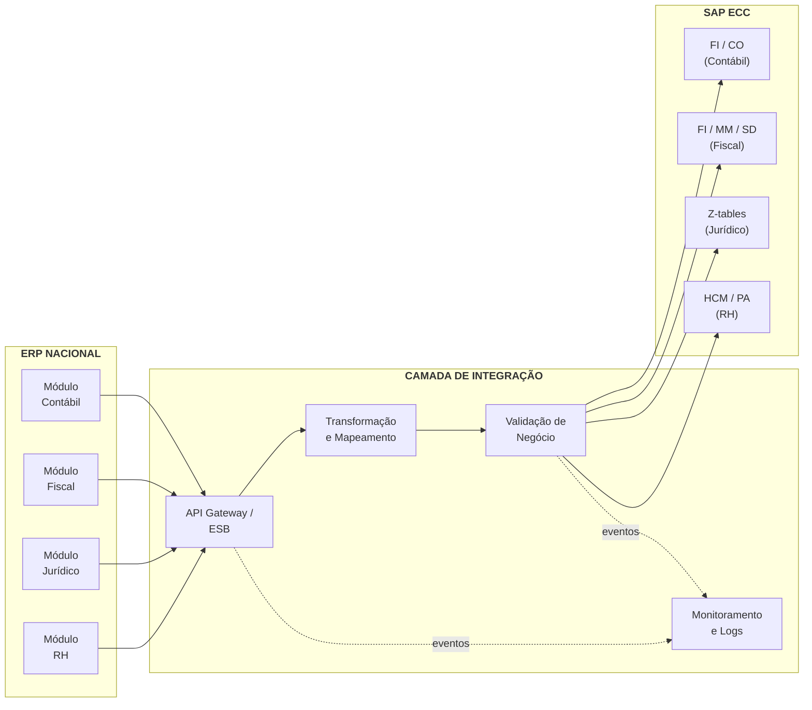
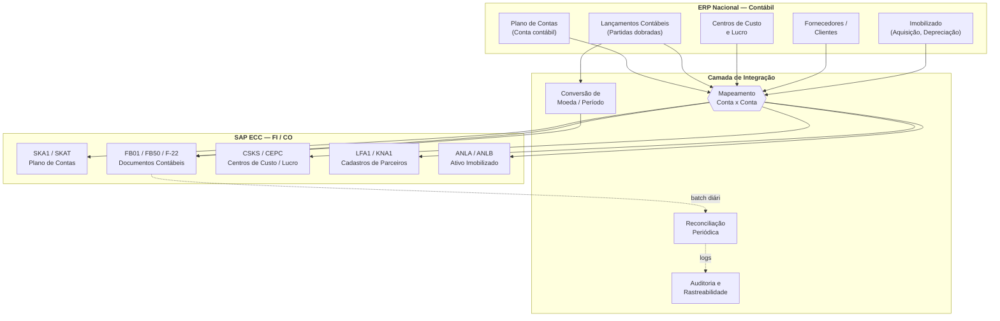
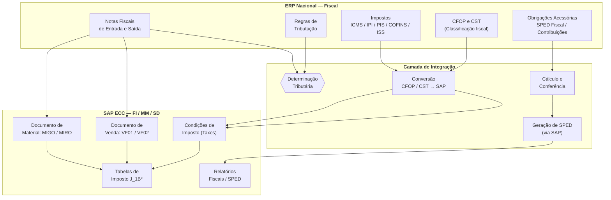
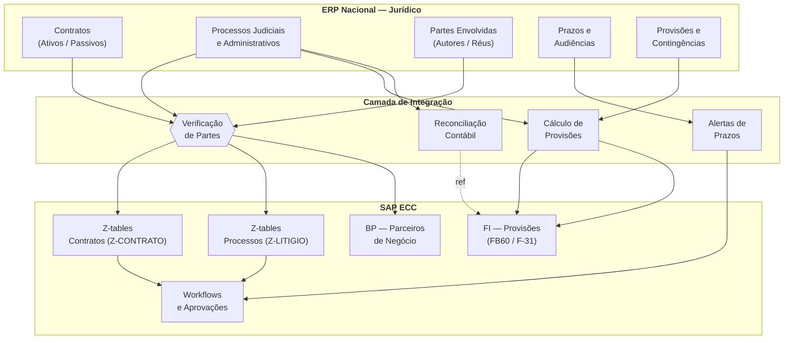
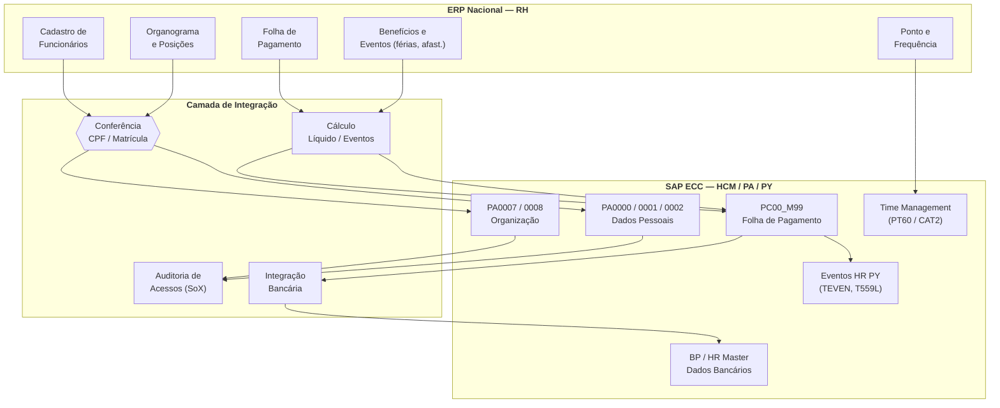

# Case-Arquitetura-Integracao-SAP-x-ERP-On-Premise
Case Arquitetura Integracao SAP x ERP On Premise

## Resumo Executivo

| Campo | Descrição |
|-------|-----------|
| **PROJETO** | Integração SAP ECC (On Premise) x ERP Nacional (On Premise) |
| **DESAFIO** | SOAP (SAP) vs REST (ERP) - protocolos incompatíveis |
| **SOLUÇÃO** | Integrador com conversão REST → SOAP operando no KS |
| **VOLUMETRIA** | 350 mil registros/semana (capacidade calculada: 362k) |
| **ARQUITETURA** | KS + hardware xxxx + RabbitMQ DLQ + PostgreSQL Master/Slave |
| **DIFERENCIAIS** | Batch adaptativo, Dead Letter Queue, Persistent Volume |
| **PRAZO ESTIMADO** | 8 a 12 semanas (Em meses: aproximadamente 2 a 3 meses) | 
| **METODOLOGIA** | Scrum + SOLID + Arquitetura do Framework escolhido | 

## Contexto de Negócio

A empresa XYZ hoje utiliza somente o SAP ECC , existe a necessidade de integrar Contábil , Financeiro , Jurídico e RH vindos do ERP Nacional recem adquirido.

Este projeto visa integrar Contábil , Fiscal , Juridico e RH provenientes do ERP Nacional para o SAP ECC. 

## Cenário Atual

SAP ECC se encontra em ambiente On Premise na empresa XYZ em uma DMZ , operando com exposição de webservices SOAP . 

O ERP Nacional se encontra On Premise na Empresa XYZ porém em outro servidor e outra DMZ, operando com expisução de APIs Rest não suportando requisições SOAP. 

Mediante este cenário será construído um integrador ao qual deverá viabilizar a questão da incompatibilidade existe ECC(webservice SOAP) x ERP Nacional(API Rest) 

Ja existe um FrontEnd (em Vue.js de monitoramento e manipulação do integrador)criado pelo time da empresa XYZ que se encontra hospedado em outro servidor e outra DMZ , o integrador deverá ser construído com base nos contratos desse FrontEnd já existe.

## Visão Geral — Arquitetura de Integração

**Legenda**

- 🟧 ERP Nacional (sistemas de origem)
- ⬜ Camada de Integração (middleware)
- 🟦 SAP ECC (sistema de destino)

*Figura 1 — Topologia geral: ERP Nacional → Camada de Integração → SAP ECC.*

| Camada | Responsabilidade | Exemplos de tecnologia |
|---|---|---|
| ERP Nacional (origem) | Sistemas de operação do dia a dia nas 4 áreas | ERP genérico, APIs REST/SOAP, eventos assíncronos |
| Camada de Integração | Orquestração, transformação, validação, monitoramento | Middleware ESB, SAP PI/PO, iPaaS, Kafka, custom |
| SAP ECC (destino) | Backoffice / retaguarda financeira e de RH | BAPIs, IDocs, RFCs, Web Services ABAP |

---

## Processo 1 — Integração Contábil

**Escopo:** plano de contas, lançamentos, centros de custo, imobilizado.

*Figura 2 — Fluxo detalhado da integração Contábil.*

| Objeto | Origem (ERP Nacional) | Destino (SAP ECC) | Frequência sugerida |
|---|---|---|---|
| Plano de contas | Cadastro de contas | SKA1/SKAT | Diária (delta) + carga inicial completa |
| Lançamentos contábeis | Partidas dobradas | FB01/FB50 (BAPI_ACC_DOCUMENT_POST) | On-line (quase real-time) |
| Centros de custo | Estrutura de centros | CSKS / CEPC | Diária |
| Fornecedores / Clientes | Cadastros de parceiros | LFA1 / KNA1 / BP | On-line (criação) + batch (alterações) |
| Imobilizado | Aquisições, baixas, depreciação | ANLA / ANLB / AS01/AS02 | Diária |

---

## Processo 2 — Integração Fiscal

**Escopo:** notas fiscais, impostos, obrigações acessórias.

*Figura 3 — Fluxo detalhado da integração Fiscal.*

| Objeto | Origem (ERP Nacional) | Destino (SAP ECC) | Frequência sugerida |
|---|---|---|---|
| NF Entrada (mercadorias) | XML / evento de NF-e | MIGO (BAPI_GOODSMVT_CREATE) + MIRO | On-line |
| NF Saída | Pedido de venda / remessa | VF01/VF02 (BAPI_BILLINGDOC_CREATEMULTIPLE) | On-line / batch horário |
| Condições de imposto | Cadastros de impostos | Condições de imposto + tabelas J_1B* | Diária |
| CFOP / CST | Tabelas fiscais | Map. de CFOP / CST | Carga inicial + delta |
| SPED | Dados primários do ERP | Geração no SAP a partir dos dados integrados | Mensal |

---

## Processo 3 — Integração Jurídico

**Escopo:** contratos, processos, partes envolvidas, provisões.

*Figura 4 — Fluxo detalhado da integração Jurídica.*

| Objeto | Origem (ERP Nacional) | Destino (SAP ECC) | Frequência sugerida |
|---|---|---|---|
| Contratos | Cadastros contratuais | Z-tables custom (Z-CONTRATO) | On-line (criação) + diária (alterações) |
| Processos | Cadastros de litígios | Z-tables custom (Z-LITIGIO) | Diária |
| Partes | Cadastros de partes | BP (Business Partner) | On-line |
| Provisões / Contingências | Apuração de valores | FI (lançamentos de provisão) | Mensal ou sob demanda |
| Prazos / Audiências | Agenda jurídica | Workflows no ECC | Diária (alertas) |

---

## Processo 4 — Integração RH

**Escopo:** cadastros, organograma, folha, benefícios, ponto.

## Metodologia Aplicada ao Desenvolvimento:

Para criação do Integrador deverá ser utilizada a metologia SOLID , respeitando o funcionamento do Framework/tecnologia escolhida sem descaracterizar as mesmas.

### Solid  

S - Single Responsibility Principle (Princípio da Responsabilidade Única)
Uma classe deve ter apenas um motivo para mudar, cada classe resolve um único problema, se ela faz muitas coisas diferentes esta incorreto.

O - Open/Closed Principle (Princípio Aberto/Fechado)
Classes devem estar abertas para extensão, mas fechadas para modificação.

L - Liskov Substitution Principle (Princípio da Substituição de Liskov)
Uma classe derivada pode substituir sua classe base sem quebrar a aplicação, 

I - Interface Segregation Principle (Princípio da Segregação de Interfaces)
É melhor ter várias interfaces pequenas e específicas do que uma interface enorme, não se deve forçar uma classe a implementar métodos que ela não precisa.

D - Dependency Inversion Principle (Princípio da Inversão de Dependência)
Dependa de abstrações (interfaces), não de classes concretas, exemplo Pagamento deve depender da interface Banco(Abstrata) e não de uma implementação concreta(Banco do Brasil)

### Spring e NestJS implementam:

Arquitetura Modular com Injeção de Dependência gira em torno de @Module. Cada módulo encapsula controllers, providers e exports relacionados. Você compõe a aplicação importando módulos uns nos outros.   

### FastAPI implementa:  

Arquitetura em Camadas 

Camada de Apresentação/Controladores (Presentation/Controller Layer)  

Camada de Serviço/Negócio (Service/Business Layer)  

Camada de Acesso a Dados/Repositórios (Data Access/Repository Layer)  

Camada de Modelo/Entidade (Model/Entity Layer)  

Caso seja utilizado IA para apoio no processo de desenvolvimento, não será permitido fazer "VibeCode" , pois se faz necessário o conhecimento da codificação e sua respectiva qualidade de entrega.

## Metodologia Scrum:

Deverá seguir os ritos do Scrum , sendo adptado a realidade do Projeto , efetuando entregas semanais.

## SO Ubuntu Server + Virtualizacao Proxmox  + Cluster Kubernets

| Componente | Especificação | 
|------|-------|
| 4 vCPUs | 2 cores físicos com 2 threads cada |
| Processador |  Intel Xeon W3-2435 (8C/16T, 3.1GHz)   |
| Memória RAM | 32GB DDR5 ECC (2x16GB) |
| Armazenamento Primario | 2x HD 6 tb |
| Armazenamento Secundario | 2x SSD 2 tb |
| Fonte | 750W 80+ Platinum |

Custo da Workstation Dell Precision 5860 Tower : Custo estimado de R$ 34.900,00

Os Pods devem rodar nesta Workstation
 
### Software e Licenças

| Item	| Especificação |
|------|-------|
| Virtualização | Proxmox VE Community Edition (gratuita) |
| SO | Ubuntu Server 26.04 LTS (gratuito) |
| Cluster | Kubernetes K3s ou kubeadm (gratuito) |
| Métricas | Prometheus (gratuito) |
| Monitoramento |	Grafana (gratuito) |
| Mensageria | RabbitMQ (gratuito)|
| Documentação | Swagger (gratuito) |
| Versionamento / CI/CD | Gitlab self-managed (gratuito) | 

## Periodicidade 
Será conforme demanda dos Sistemas SAP ECC x ERP Nacional

## Latência 
As Arquiteturas SOAP e REST poderão apresentar resposta variável não sendo possivel resposta instantanea , fatores como volumetria enviada , rede , proxys/dns , operadora de internet poderão interferir nestes retornos.

## Volumetria
Estimativa de 200 a 350 mil registros por semana

Capacidade com 3 Consumers (cenário atual)

Tempo por mensagem: 5 segundos  

Mensagens por minuto por Consumer: 60 ÷ 5 = 12 msg/min  

Mensagens por hora por Consumer: 12 × 60 = 720 msg/hora  

3 Consumers = 720 × 3 = 2.160 mensagens/hora  

2.160 × 24 horas = 51.840 mensagens/dia  

51.840 × 7 dias = 362.880 mensagens/semana  

## Infra utilizada:

| Descritivo | Local | Responsavel | 
|----|------|-----------|
|SAP ECC | On Premise | Empresa XYZ |
|Integrador | On Premise | Empresa XYZ |
|ERP Nacional | On Premise | Empresa XYZ |

## Tecnologias:

| Tecnologia | Distribuidor | 
|----|-----------|
|SAP ECC | SAP |
|Python | Python Software Foundation (PSF)| 
|FastAPI | Scalar.com |
| Pip | Python Packaging Authority |
|Java | Oracle |
| SpringBoot| Broadcom |
| Maven | Apache Software Foundation |
| Typescript | Microsoft |
| NestJS | Kamil Mysliwiec |
| Npm | Npm Inc |
| Prometheus | Cloud Native Computing Foundation (CNCF)|
| Grafana | Grafana Labs |
| Swagger | SmartBear Software |
| RabbitMQ | Broadcom |
|PostgresSQL | The PostgreSQL Global Development Group |

## Funcionamento da Integração:

Uma vez que o usuário efetue algum processo relacionado à Contábil , Fiscal, Jurídico e RH no ERP Nacional , o ERP deverá efetuar uma requisição para o EndPoint REST de Autenticação do Integrador passando User e Senha,
ao qual será validado na base Postgres (previamente cadastrado), a requisição devolverá um token JWT (Validade de 6 Horas) ao qual deverá ser utilizado pelo ERP para efetuar outra requisição ao EndPoint REST (Post , trafegando JSON(contendo informações de negocio) e utilizando Https).  

Ao Receber a requisição o Nginx deverá verificar o Producer que se encontra disponivel e deverá distribuir o JSON ao mesmo.

O Producer deverá validar e posteriormente converter o JSON para o Padrao de Mensageria ao qual o Broker RabbitMQ espera (Exchange/Queue) e postar o Mesmo na sua respectiva Exchange/Queue

Os Consumers deveráo estar monitorando as Exchanges/Queues , sendo assim o que estiver livre deverá pegar a mensagem convertida(XML) e inserir na respectiva tabela do postgres com o status Ready for shipment,
após efetuar o insert only com sucesso deverá retornar http code 200 ao Nginx que fará o retorno a sua respectiva origem, em caso de erro deverá retornar 400 .

O Nginx vai estar operando em modo cluster.

O RabbitMQ vai estar operando em modo cluster.

O RabbitMQ deverá possuir Dead Letter Exchange configurada enviando após 3 tentativas falhas para DLQ Consumer

RabbitMQ Queue → Consumer (3 tentativas) → Dead Letter Exchange → DLQ Consumer (alerta humano)

uma Cron Job Adaptativo com Controle de Timeout que executa de 5 em 5 minutos deverá varrer as tabelas e obter os registros com ready for shipment efetuando o envio para o SAP ECC (Autenticação Basic Usuário e Senha) em lotes , atualizando todos que tiveram sucesso para o status processed

 O Cron Job adaptativo ajusta dinamicamente o tamanho dos lotes com base no tempo real de resposta do SAP ECC, o sistema deverá monitorar continuamente o tempo de resposta do SAP ECC, lotes menores serão enviados automaticamente quando o SAP estiver lento,
 lotes maiores quando a performance estiver ok.

Logica: 

Monitora continuamente o tempo de resposta do SAP ECC

Tempo limite por lote: 50 segundos (margem de 10s dos 60s totais)

Tamanho do lote varia de 2 a 8 registros conforme performance:

* SAP rápido (< 3s): lote de 8 registros
* SAP normal (3-6s): lote de 5 registros
* SAP lento (6-10s): lote de 3 registros
* SAP crítico (>10s): lote de 2 registros

Registros não processados permanecem com status ready for shipment

No Próximo ciclo deve processar os remanescentes

Se tempo restante for inferior a 10 segundos, interrompe o lote

Todos os WebServices / APIs deverão suportar paginação

Cada Requisição possuirá 60s até apresentar time out , existe um limite de 8 mega de trafego por requisição 

## Desenho KS namespace Integrador

## Desenho EKS namespace Observability

## Desenho Arquitetural:

## Escopo / Pré Requisitos
Integrar SAP ECC com ERP Nacional  

Desenvolver Integrador  

Utilizar Integrador Desenvolvido para viabilizar a integracao  

Fornecimento do Usuário / Senha dos WebServices SAP ECC  

WebServices SAP ECC Acessíveis ao Integrador  

APIS ERP Nacional Acessíveis ao Integrador  

## Não Escopo
Configuração do SAP ECC  

Configuração do ERP Nacional

Configuração das Credenciais SAP ECC

Configuração das Credenciais ERP Nacional  

Itens não detalhados nesta solução  

Configuração de VPN

Configuracao de mTLS

Configuração Business Intelligence

Configuração do Active Directory

Não será efetuado acesso direto a Base do SAP ECC

Não será efetuado acesso direto a Base do ERP Nacional
 

## Pipeline 

Automatizar o ciclo de vida do integrador, desde a validação de código até a implantação no Cluster.

A Ferramenta base será o GitLab self-managed CI/CD on premise
### Fluxo Conceitual

**Etapas:**  
`[Commit]` → `[Lint]` → `[Testes]` → `[Build]` → `[Deploy Dev]` → `[Teste Contrato]` → `[Deploy Prod]`

**Responsabilidades:**  
`Developer` ↑ `Qualidade Código` ↑ `Validação Funcional` ↑ `Imagem Docker` ↑ `Homologação Automático` ↑ `Validação API (SDD)` ↑ `Produção Manual`

### Triggers (Gatilhos)

| Evento | Ação | Ambiente Destino |
|--------|------|------------------|
| Push na branch `develop` | Pipeline completa até Deploy DEV | Desenvolvimento |
| Push na branch `main` | Pipeline até Deploy PROD (manual) | Produção |
| Merge Request para `main` | Pipeline até Testes | N/A (apenas validação) |
| Tags (v1.0.0) | Pipeline completa + rollback preparado | Produção |

#### ESTÁGIOS DA PIPELINE (DETALHADO)

#### Estágio 1 - Lint (Análise Estática de Código)

Objetivo: Garantir padronização do código e identificar problemas antes dos testes.

Atividades:

Execução do ruff para análise estática (Python) ou eslint (TypeScript/NestJS) ou Checkstyle + PMD (Java/Spring)

Execução do black ou prettier para formatação

Validação de segurança básica (bandit, se Python, Semgrep se Typescript, FindSecBugs se Java )

Critério de Sucesso:

0 erros de lint

0 warnings críticos de segurança

Tempo Estimado: 30 segundos

Falha na etapa: Pipeline interrompida, notificação ao autor do commit.  

#### Estágio 2 - Testes (Unitários e Integração)
Objetivo: Validar funcionalidades e integração com banco de dados.

Sub-etapas:

2.1. Testes Unitários
Cobertura mínima exigida: 80% (linhas de código)

Frameworks sugeridos: pytest (Python) ou JUnit (Java/Spring) ou Jest(Typescript)

Foco nos REST↔SOAP, regras de negócio (paginação, timeout)

2.2. Testes de Integração
Banco PostgreSQL em container (GitLab Services)

Teste de conexão simultânea com SAP ECC (mock) e ERP Nacional (mock)

Simulação de alto volume (até 350k registros/semana)

2.3. Testes de Contrato 
Validação da API do integrador contra o OpenAPI/Swagger definido pelo FrontEnd Vue.js

Uso da biblioteca schemathesis para geração automática de testes

Critério de Sucesso:

100% dos testes unitários passando

100% dos testes de integração passando

Cobertura ≥ 80%

Tempo Estimado: 3-5 minutos

Artefatos Gerados:

Relatório de cobertura (HTML)

Logs de testes (JSON)

### Estágio 3 - Build (Construção da Imagem Docker)
Objetivo: Criar imagem executável do integrador para deploy.

Atividades:

Leitura do Dockerfile (multi-stage para otimização)

Build da imagem com tag baseada no commit

Tag latest para ambiente DEV, tag stable para PROD

Push para Amazon ECR (Elastic Container Registry)

Critério de Sucesso:

Build concluído sem erros

Imagem < 500MB (otimizada)

Push para Cluster confirmado

Tempo Estimado: 2-3 minutos

Artefatos Gerados:

Imagem Docker armazenada no Cluster

#### 4 - Deploy (Implantação)  

4.1. Deploy em Desenvolvimento (Automático)
Objetivo: Atualizar ambiente DEV para validação interna.

Atividades:

Conexão com KS local

Force new deployment do serviço integrador-dev

Health check: aguardar endpoint /health retornar 200

Critério de Sucesso:

Novo container em execução

Health check OK em até 60 segundos

Tempo Estimado: 2 minutos

Rollback automático: Se health check falhar, mantém versão anterior.

4.2. Deploy em Produção (Manual - Aprovação)
Objetivo: Implantar em PROD com validação humana.

Atividades:

Executado apenas na branch main

Requer aprovação manual no GitLab (via approvers rule)

Após aprovação, atualiza serviço integrador-prod

Executa smoke tests pós-deploy

Critério de Sucesso:

Aprovação manual obtida

Deploy concluído e validado

Tempo Estimado: 5 minutos (incluindo aprovação)

## Métricas  

### Prometheus  

No cluster KS já existente mas em um namespace separado chamado Observability estará o Prometheus .

Sua função é a de coletar métricas de todos os Pods (POD01 a POD13), sendo FrontEnd , Nginx, RabbitMQ (filas, consumers, producers), Banco de dados (Base Integrador, replica 1 , replica 2), CronJob, Kubernetes (CPU, memória, rede, número de réplicas, restart de pods).

Se conecta das seguintes formas:

ServiceMonitor (Prometheus Operator) aponta para os endpoints /metrics de cada aplicação

RabbitMQ expõe métricas via plugin Prometheus.

Banco de dados via Postgres Exporter.

## Monitoramento

### Grafana

No cluster KS já existente mas em um namespace separado chamado Observability estará o Grafana.  

Sua função é fonecer dashboards para visualização das métricas provenientes do Prometheus.

O que será monitorado visualmente nos dashboars:  

Por POD: uso de CPU/memória, latência de respostas HTTP (200), taxa de erro.

RabbitMQ: tamanho de filas, taxa de publish/consume, consumers ativos.

Base de dados: conexões ativas, tempo de query, taxa de inserção/leitura , taxa de replica.  

## Banco de Dados - Arquitetura Master / Réplicas

O PostgreSQL será configurado em cluster com 1 nó Master e 2 nós Réplicas (Slaves):

- **Master (POD10):** Responsável por todas as operações de escrita (INSERT dos 3 Consumers e UPDATE do Cron Job). Permite leitura apenas em cenários de contingência.

- **Slave 1 (POD11):** Dedicada exclusivamente para leitura pelo Cron Job. Isola a varredura dos lotes (a cada 5 minutos) das operações de escrita.

- **Slave 2 (POD12):** Dedicada exclusivamente para leitura pelo Front End (Vue.js). Garante que os dashboards de monitoramento não impactem a performance da ingestão de dados.

A replicação é feita via Streaming Replication do PostgreSQL, com tempo de atraso inferior a 1 segundo em condições normais.

Esta arquitetura garante que os 350 mil registros semanais sejam processados sem contenção entre operações de leitura e escrita, além de fornecer alta disponibilidade para consultas de monitoramento.  

### Política de Sanitização da Base de Dados

Será implementado um script automatizado de limpeza (housekeeping) para controle do crescimento da base de dados e conformidade com políticas de retenção de dados.

**Configuração da Política:**

| Parâmetro | Valor |
|-----------|-------|
| **Frequência** | Mensal (último dia de cada mês) |
| **Horário** | 23:00 (horário de baixa demanda) |
| **Critério de retenção** | Manter registros dos últimos 10 dias |  

Registros com status `processed` há mais de 10 dias serão eliminados.  

Registros com status `ready_for_shipment` ou `error` NÃO serão removidos (aguardam processamento).  

A limpeza é realizada apenas no Master, replicada automaticamente para os Slaves.  

## Cronograma do Projeto de Integração SAP ECC × ERP Nacional

### Visão Geral do Cronograma

**Duração Total:** 8 a 12 semanas (2 a 3 meses)

| Fase | Período | Atividades Principais | Duração |
|------|---------|----------------------|---------|
| Fase 1 | Semana 1-2 | Setup EKS + PostgreSQL Master/Slave + RabbitMQ DLQ | 2 semanas |
| Fase 2 | Semana 3-4 | Desenvolvimento Producer/Consumer (REST → SOAP) | 2 semanas |
| Fase 3 | Semana 5-6 | Cron Job adaptativo + lote dinâmico | 2 semanas |
| Fase 4 | Semana 7-8 | Monitoramento + Pipeline CI/CD + Testes | 2 semanas |
| Fase 5 | Semana 9-12 | Homologação + Ajustes + Deploy Produção | 4 semanas |

